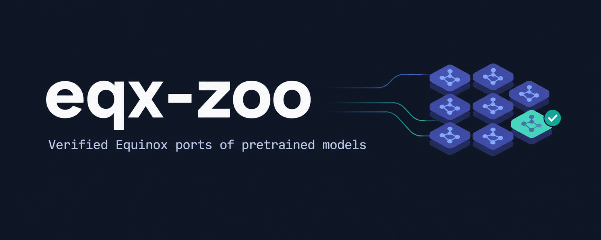

<p align="center">
  
</p>

<p align="center">
<a href="https://github.com/xquantize/eqx-zoo/actions/workflows/ci.yml"></a>
<a href="https://pypi.org/project/eqx-zoo/"></a>
<a href="LICENSE"></a>

<a href="https://github.com/patrick-kidger/equinox"></a>
</p>

eqx-zoo provides pretrained models as plain [Equinox](https://github.com/patrick-kidger/equinox) modules, loaded straight from Hugging Face checkpoints and numerically verified against the reference implementation in 🤗 Transformers.

Every model is an ordinary pytree, so `jax.jit`, `jax.grad`, `jax.vmap` and the rest of the JAX ecosystem work on it directly.

## Installation

```bash
pip install eqx-zoo
```

Requires Python 3.12+. The example below also uses `pip install tokenizers`.

## Quick example

```python
import jax.numpy as jnp
from tokenizers import Tokenizer

from eqx_zoo import CausalLM, generate

tokenizer = Tokenizer.from_pretrained("Qwen/Qwen3-0.6B")
model = CausalLM.from_pretrained("Qwen/Qwen3-0.6B")

prompt = jnp.array(tokenizer.encode("The capital of France is").ids)
tokens = generate(model, prompt, max_new_tokens=30)
print(tokenizer.decode(tokens.tolist()))
# Paris. The capital of Italy is Rome. The capital of Spain is Madrid. ...
```

## Batched generation

Prompts of different lengths are left-padded and generated together. With greedy decoding, each row is identical to generating that prompt on its own.

```python
from eqx_zoo import generate_batch

tokenizer.enable_padding(direction="left")
prompts = ["The capital of France is", "The largest planet in the solar system is"]
batch = tokenizer.encode_batch(prompts)

ids = jnp.array([e.ids for e in batch])
mask = jnp.array([e.attention_mask for e in batch])
tokens = generate_batch(model, ids, mask, max_new_tokens=20)
```

## Models

Any checkpoint with a supported architecture loads with `CausalLM.from_pretrained`, from the Hugging Face Hub or a local directory. These checkpoints are verified by the test suite:

| Architecture | Verified checkpoints |
|---|---|
| `LlamaForCausalLM` | [SmolLM2-135M](https://huggingface.co/HuggingFaceTB/SmolLM2-135M), [Llama 3.2 1B](https://huggingface.co/meta-llama/Llama-3.2-1B) |
| `Qwen3ForCausalLM` | [Qwen3-0.6B](https://huggingface.co/Qwen/Qwen3-0.6B) |
| `Qwen2ForCausalLM` | [Qwen2.5-0.5B](https://huggingface.co/Qwen/Qwen2.5-0.5B) |

Each verified checkpoint is tested against Hugging Face activations in two tiers:

- **float32:** every layer's output must match, and greedy generation must reproduce the reference output token for token.
- **bfloat16:** logits must be about as accurate as Hugging Face's own bfloat16, measured against its float32 output. Exact greedy agreement isn't required in bf16, since it drifts even between Hugging Face's own bf16 and float32 runs.

Every architecture is also tested on tiny randomly initialised models, which cover code paths that no single checkpoint exercises. See [`tests/`](tests).

## Development

```bash
git clone https://github.com/xquantize/eqx-zoo && cd eqx-zoo
uv sync
uv run pytest -m "not checkpoint"   # fast: tiny random models, no downloads
uv run pytest                       # full: also downloads and verifies checkpoints
uv run python benchmarks/generation.py Qwen/Qwen3-0.6B   # load, compile and throughput
```

Contributions are welcome. [`AGENTS.md`](AGENTS.md) describes the conventions every model follows.

## See also

- **Neural networks:** [Equinox](https://github.com/patrick-kidger/equinox).
- **Typing:** [jaxtyping](https://github.com/patrick-kidger/jaxtyping).
- **Other JAX model collections:** [Levanter](https://github.com/stanford-crfm/levanter) (LLM training), [Bonsai](https://github.com/jax-ml/bonsai) (Flax NNX), [Equimo](https://github.com/RhizomeResearch/Equimo) (vision).

## License

Apache 2.0. Pretrained weights are distributed by their original authors under their own licenses.
